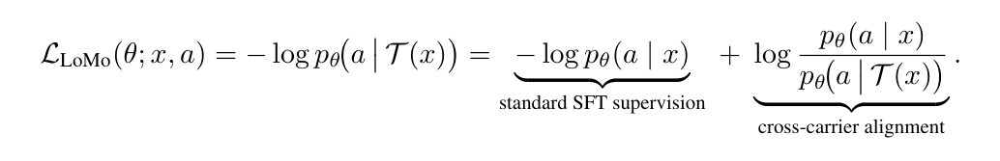
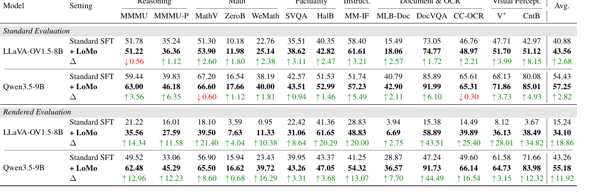
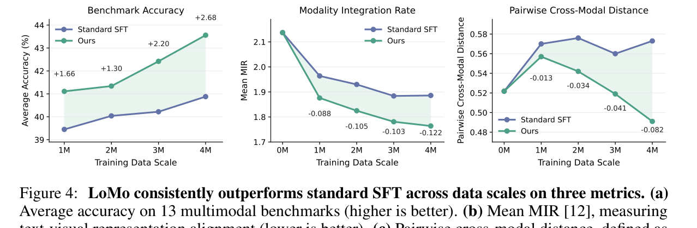
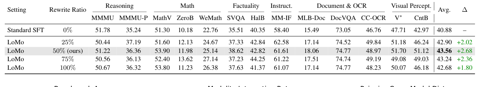

<div align="center">
  <h1 align="center">LoMo: Local Modality Substitution for Deeper Vision-Language Fusion</h1>

  Feng Han<sup>1,2</sup>, Zhixiong Zhang<sup>2,3</sup>, Zheming Liang<sup>2,4</sup>, Yibin Wang<sup>1,2</sup>, Jiaqi Wang<sup>2,5,*</sup>

  <br>

  <sup>1</sup>Fudan University, <sup>2</sup>Shanghai Innovation Institute, <sup>3</sup>Shanghai Jiao Tong University

  <br>

  <sup>4</sup>University of Science and Technology of China, <sup>5</sup>JD.COM

  <a href="./LoMo-Technical-Report.pdf">
    
  </a>
  <a href="https://maplebb.github.io/LoMo/">
    
  </a>
</div>

## News

- [2026/05/27] We release the technical report and project page for **LoMo**.

## Introduction

Vision-Language Models (VLMs) can reason over both language and images, but replacing a textual question with its rendered-image counterpart should ideally leave model performance essentially unchanged because the semantics are the same. In practice, this local modality substitution induces dramatic performance degradation. We identify this as a **carrier sensitivity** problem caused by a modality gap between equivalent text and visual carriers.

**LoMo** introduces **Local Modality Substitution**, a lightweight and architecture-agnostic data curation paradigm for deeper vision-language fusion. LoMo selects a semantically coherent span from a text-only prompt, renders that span as an image, applies semantics-preserving perceptual distortions, and substitutes the image back into the original prompt. The resulting `text -> visual carrier -> text` sequence forces the model to integrate equivalent information across carriers during standard supervised fine-tuning.

<p align="center">
  
</p>
<p align="center"><em>(a) Rendered questions reduce accuracy. (b) Larger representation gaps cause larger drops. (c) LoMo pulls equivalent text/image carriers closer.</em></p>

<p align="center">
  
</p>
<p align="center"><em>LoMo turns a text-only instance into a local text-image-text training sequence.</em></p>

## Highlights

- **Diagnoses carrier sensitivity in VLMs.** Replacing a textual question with its rendered-image counterpart causes consistent accuracy drops across strong VLMs, revealing that equal semantics are not treated equally across text and image carriers.
- **Data-centric cross-modal alignment.** LoMo provides implicit supervision for cross-carrier representational invariance without modifying model architecture, training objective, or inference-time behavior.
- **Structure-aware local substitution.** Instead of rendering the whole prompt, LoMo localizes a middle span, renders only that target segment, and keeps surrounding text as context to encourage fine-grained fusion.
- **Consistent benchmark gains.** Across 13 multimodal benchmarks, LoMo improves over standard SFT by **+2.68** points on LLaVA-OneVision-1.5-8B and **+2.82** points on Qwen3.5-9B under standard evaluation.
- **Stronger rendered-text robustness.** Under rendered evaluation, where text questions are delivered as images, LoMo improves average accuracy by **+18.86** points on LLaVA-OneVision-1.5-8B and **+11.92** points on Qwen3.5-9B.

## Method

LoMo transforms a single-modal training instance into an interleaved multimodal instance through three stages:

1. **Structure-Aware Span Localization.** The input is chunked in a formula-aware manner and a semantically coherent middle span is selected as the target visual span.
2. **Visual Rendering.** The selected span is routed to a LaTeX renderer when it contains mathematical expressions and to a standard text renderer otherwise.
3. **Perceptual Distortion.** The rendered image is perturbed with semantics-preserving visual degradations such as rotation, blur, stains, shadows, or local wave deformation.

The paper shows that optimizing the carrier-substituted instance is equivalent to providing an extra cross-carrier alignment signal:

<p align="center">
  
</p>

Under expectation, the log-ratio corresponds to a KL-style pressure that aligns the model's predictions on the original text carrier and the substituted text-image carrier. This creates a training example where the answer still depends on the same semantics, but the model must combine textual context and rendered visual text within one sequence.

## Main Results

<p align="center">
  
</p>
<p align="center"><em>LoMo improves average accuracy across both evaluated backbones.</em></p>

<p align="center">
  
</p>
<p align="center"><em>Main results under standard and rendered evaluation protocols.</em></p>

LoMo gives stable improvements across reasoning, math, factuality, instruction following, document/OCR understanding, and visual perception benchmarks. The gains become especially large under rendered evaluation, showing that LoMo directly addresses the cross-carrier fragility exposed by question rendering.

## Analysis

<p align="center">
  
</p>
<p align="center"><em>LoMo improves accuracy and cross-modal representation alignment as data scale increases.</em></p>

LoMo improves both benchmark accuracy and representation alignment as training data scale grows. It reduces Modality Integration Rate and pairwise cross-modal distance, indicating stronger cross-modal fusion.

<p align="center">
  
</p>
<p align="center"><em>Rewrite-ratio ablation on LLaVA-OneVision-1.5-8B.</em></p>

## Citation

```bibtex
@article{lomo2026,
  title={LoMo: Local Modality Substitution for Deeper Vision-Language Fusion},
  author={Feng Han and Zhixiong Zhang and Zheming Liang and Yibin Wang and Jiaqi Wang},
  journal={Technical Report},
  year={2026}
}
```

## Contact

For questions or suggestions, please open an issue in this repository.
