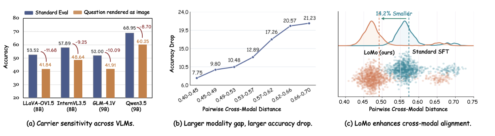
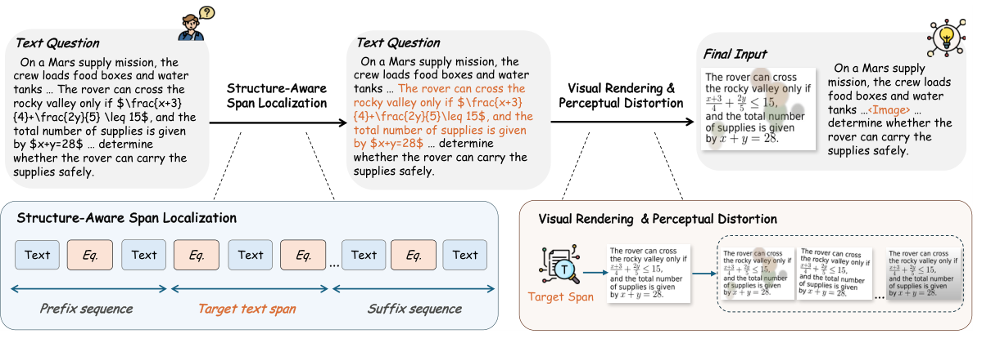
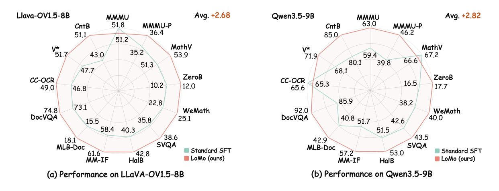

<div align="center">
  <h1 align="center">LoMo: Local Modality Substitution for Deeper Vision-Language Fusion</h1>

  <p>
    Feng Han<sup>1,2</sup>, Zhixiong Zhang<sup>2,3</sup>, Zheming Liang<sup>2,4</sup>, Yibin Wang<sup>1,2</sup>, Jiaqi Wang<sup>2,5,*</sup>
  </p>

  <p>
    <sup>1</sup>Fudan University, <sup>2</sup>Shanghai Innovation Institute, <sup>3</sup>Shanghai Jiao Tong University<br>
    <sup>4</sup>University of Science and Technology of China, <sup>5</sup>JD.COM
  </p>

  <p>
    <a href="./LoMo-Technical-Report.pdf"></a>
    <a href="https://maplebb.github.io/LoMo/"></a>
  </p>
</div>

## 🔥 News

- [2026/05/27] 🔥🔥 We release the technical report and project page for **LoMo**.

## Introduction

Vision-Language Models still show **carrier sensitivity**: changing a textual question into a rendered-image question can sharply reduce accuracy even when the semantics stay unchanged. **LoMo** addresses this gap by locally replacing part of a single-modal prompt with its rendered visual counterpart, encouraging VLMs to fuse equivalent information across text and image carriers.

<p align="center">
  
</p>
<p align="center"><em>Rendered questions reduce accuracy. Larger representation gaps cause larger drops. LoMo pulls equivalent text/image carriers closer.</em></p>

### ✨ Highlights:

LoMo is a lightweight, architecture-agnostic data curation recipe for standard SFT. It localizes a coherent text span, renders it as an image, and substitutes it back into the original context, creating a `text -> visual carrier -> text` sequence that provides an extra cross-carrier alignment signal. Across 13 multimodal benchmarks, LoMo improves over Standard SFT by **+2.68** points on LLaVA-OneVision-1.5-8B and **+2.82** points on Qwen3.5-9B, while requiring no architectural changes or inference-time overhead.

<p align="center">
  
</p>

<p align="center">
  
</p>

## ✨ Evaluation

## 📧 Contact

For questions or suggestions, please open an issue in this repository.

## ⭐ Citation

```bibtex
@article{lomo2026,
  title={LoMo: Local Modality Substitution for Deeper Vision-Language Fusion},
  author={Feng Han and Zhixiong Zhang and Zheming Liang and Yibin Wang and Jiaqi Wang},
  journal={Technical Report},
  year={2026}
}
```
